<picture>
  <source media="(prefers-color-scheme: dark)" srcset="assets/banner-dark.svg">
  <source media="(prefers-color-scheme: light)" srcset="assets/banner-light.svg">
  
</picture>

[English](README.md) | Bahasa Indonesia

### Tentang

Halo, saya Luthfi (Muhammad Luthfi Abdillah), lulusan S1 Teknologi Informasi dari Sleman, Yogyakarta, dengan IPK 3.83. Saya membangun AI agent dan produk web dari ujung ke ujung, mengujinya dengan standar QA industri, dan merekayasa data serta model machine learning di baliknya. Pekerjaan saya mencakup otomatisasi workflow berbasis LLM dengan n8n, sistem rumah sakit dan pendidikan dengan Laravel dan Flutter, serta machine learning yang dipublikasikan di Kaggle.

<picture>
  <source media="(prefers-color-scheme: dark)" srcset="assets/stats-id-dark.svg">
  <source media="(prefers-color-scheme: light)" srcset="assets/stats-id-light.svg">
  
</picture>

### Keahlian

| Bidang | Yang saya kerjakan | Tools |
| :--- | :--- | :--- |
| **AI Agents & LLM** | Otomatisasi workflow n8n, orkestrasi webhook dan REST multi-langkah, chatbot asisten kesehatan, prompting dengan guardrail | `n8n` `Gemini` `OpenAI` `Llama` |
| **QA & Testing** | Pengujian black-box, regresi, dan SAST, siklus pengujian XP, otomasi browser | `Playwright` `SAST` |
| **Full-Stack & Mobile** | Platform web, sistem administrasi, dan aplikasi lintas platform | `Laravel` `React 19` `Next.js` `TypeScript` `Flutter` `Django` |
| **Data & ML** | Pipeline ETL, scraping, NLP, ML klasik, dan graph neural network | `Python` `scikit-learn` `PyTorch Geometric` `Spark` `Kafka` |
| **Infra & Desain** | Database, container, dan prototyping UI/UX | `PostgreSQL` `MySQL` `MongoDB` `Docker` `Kubernetes` `Figma` |

### Pengalaman

| Periode | Peran | Sorotan |
| :--- | :--- | :--- |
| Mar 2025 sampai Jan 2026 | **Full-Stack Developer Intern**, PT Global Data Inspirasi (Datains) | Membangun ASSRI, simulator telekonsultasi medis berbasis Laravel, dengan AI agent n8n (Gemini, OpenAI, Llama) untuk skrining pra-konsultasi dan penjadwalan. |
| Jul sampai Agu 2025 | **Freelance Full-Stack Developer**, SDIT Luqman Al Hakim | Website sekolah dengan CMS mandiri berisi 15+ modul admin, diuji dengan siklus XP. |
| Mei sampai Jun 2025 | **Freelance Full-Stack Developer**, Life Media | SaaS penerimaan murid baru (SPMB) multi-tenant berbasis Laravel dengan laporan PDF dan Excel. |
| Okt 2024 sampai Jan 2025 | **Full-Stack Developer Intern**, RS AMC Muhammadiyah | Tiga sistem web rumah sakit (rekam MCU, persetujuan cuti dengan pass rate black-box 100%, presensi wajah dan GPS) serta aplikasi Flutter SatuAMC. |

### Proyek unggulan

| Proyek | Fungsi |
| :--- | :--- |
| **ASSRI** | Simulator telekonsultasi medis dengan AI agent n8n untuk skrining pasien |
| **Healtisin** | Chatbot skrining kesehatan, semi-finalis PROXOCORIS International |
| **SatuAMC** | Aplikasi Flutter lintas platform untuk presensi dan cuti rumah sakit |
| **SPMB SaaS** | Portal penerimaan murid baru multi-tenant dengan laporan PDF dan Excel |
| **QR-Camera** | Ekstensi browser yang menyuntikkan video QR virtual untuk pengujian webcam QA |
| **Prompt-Engineering-Collection** | Repo riset SAST untuk mengevaluasi mutu kode hasil LLM |
| **Flowerhub Marketplace** | E-commerce pemesanan karangan bunga dengan pembayaran Midtrans |
| **Tokprice-Predictor** | Aplikasi prediksi harga produk e-commerce dengan TF-IDF dan regresi |
| **Yahoo Finance Dashboard** | Dashboard saham real-time dengan candlestick interaktif |
| **HOPE (Hospital Maze)** | Game labirin konsol C++ dengan algoritma DFS |

Selengkapnya di [github.com/MasterPandaa](https://github.com/MasterPandaa?tab=repositories).

### Data science dan Kaggle

| Model | Pendekatan | Hasil |
| :--- | :--- | :--- |
| Deteksi fraud | Logistic Regression | Akurasi 94%, precision 0.89, recall 0.82 |
| Sentimen ulasan Gojek | TF-IDF + Random Forest | Akurasi 86%, F1 0.84 |
| Sentimen ulasan Spotify | Bi-LSTM + word embedding | Akurasi 89%, F1 0.87 |
| Rekomendasi film | GraphSAGE (PyTorch Geometric) | Recall@10 0.31, NDCG@10 0.28 |
| Prediksi penjualan Tokopedia | Ridge Regression | R² 0.78, RMSE 42.3 |
| Risiko preeklamsia | Random Forest multiclass | Akurasi 91%, recall 0.88 |

Saya juga mempublikasikan dataset terbuka di [Kaggle](https://www.kaggle.com/pandaa12): sekitar 50.000 produk Tokopedia, 18.000 komentar YouTube tentang banjir Sumatra 2025, 12 set ulasan Google Play, hotel Yogyakarta dari Traveloka, dan data film TMDB. Masing-masing disertai scraper sendiri (Playwright, `google-play-scraper`, TMDB API).

### Riset dan penghargaan

- **2026**: riset SAST untuk mengevaluasi mutu kode hasil LLM melalui prompt engineering.
- **2025**: semi-finalis PROXOCORIS International Competition lewat Healtisin.
- **2025**: pengabdian masyarakat literasi digital (PKM Pra Ngadisuryan, KKN Dabag 2).
- **2024**: jurnal tentang sistem informasi cuti berbasis web di Rumah Sakit Asri Medical Center.
- **2024**: Mahasiswa Berprestasi (Mawapres) universitas, sertifikasi kompetensi BNSP, dan pencatatan HKI dari Kemenkumham RI.

 

<a href="mailto:luthfiabd.14@gmail.com">
<picture>
  <source media="(prefers-color-scheme: dark)" srcset="assets/cta-id-dark.svg">
  <source media="(prefers-color-scheme: light)" srcset="assets/cta-id-light.svg">
  
</picture>
</a>

[Portofolio](https://portofolio-luthfi.up.railway.app) | [LinkedIn](https://www.linkedin.com/in/luthfiabdl/) | [Kaggle](https://www.kaggle.com/pandaa12) | [Email](mailto:luthfiabd.14@gmail.com) | [WhatsApp](https://wa.me/62895640311157) | [Instagram](https://instagram.com/luthfiabdl_)