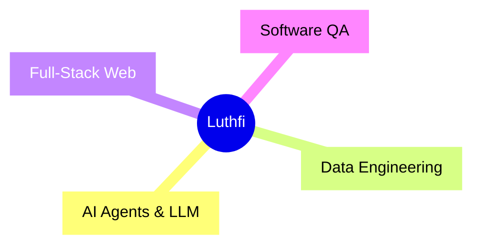

<div align="center">

# Muhammad Luthfi Abdillah
**Data Engineer • Full-Stack Developer • AI Builder**

<br>

[](https://github.com/MasterPandaa)
[](https://github.com/MasterPandaa/MyPortfolio)
[](https://github.com/MasterPandaa?tab=repositories)

*Building intelligent systems, clean interfaces, and data products that scale.*

</div>

---

### 🧠 What I Do



```ts
const luthfi = {
  role: "Data Engineer & Full-Stack Developer",
  specialization: [
    "🤖 AI Agent / LLM Orchestration (n8n, custom providers)",
    "📊 Data Engineering & Science (ETL, ML pipelines, analytics)",
    "🧪 Software Quality Assurance (automation, testing strategy)",
    "🌐 Full-Stack Web (React 19, TanStack, Tailwind v4)"
  ],
  currentFocus: "Portfolio 2026 — React 19 + TanStack Start + Tailwind v4",
  philosophy: "Simple. Functional. Maintainable. Scalable."
};
```

---

### ⚡ Tech Arsenal

<div align="center">

[](https://skillicons.dev)

</div>

> **Core Stack:** React 19 · TypeScript · TanStack Start/Router/Query · Tailwind CSS v4 · Vite 8
> **UI & Data:** Radix UI · Lucide · Recharts · React Hook Form + Zod · TanStack Query
> **Data/AI:** Python · ETL Pipelines · n8n Automation · ML Prototyping
> **Infra:** Docker · PostgreSQL · MySQL · Git · CI/CD

*Fonts: Syne + Plus Jakarta Sans • Dark/Light Theme • ID/EN Bilingual • SSR + SPA*

---

### 🏆 Featured Work

| Project | Description | Stack | Highlights |
|---|---|---|---|
| [**MyPortfolio 2026**](https://github.com/MasterPandaa/MyPortfolio) | **Flagship portfolio** — bilingual, glassmorphism, bubble sidebar, bottom nav, project showcases (Web/Mobile/UI/UX/AI-Data), contact form | React 19, TanStack Start, Tailwind v4 | 🌓 Theme • 🌐 i18n • ✨ Micro-animations • 📱 Responsive |
| [**mimik-plus**](https://github.com/MasterPandaa/mimik-plus) | Community fork of Mimik — custom AI providers + Bahasa Indonesia support | TypeScript | 🤖 AI Providers • 🇮🇩 Localization • 🔧 Extensible |
| [**CV-ATS-Builder**](https://github.com/MasterPandaa/CV-ATS-Builder) | ATS-optimized CV builder, v1.0.0 | TypeScript | 📄 ATS-friendly • 🎨 Clean output • ⚡ Fast |

> **240+ repositories** — exploring, learning, shipping. [Browse all →](https://github.com/MasterPandaa?tab=repositories)

---

### 📈 GitHub Pulse

<div align="center">


<br>


</div>

---

### 🎯 Currently

<div align="center">

| Focus | Learning | Goal |
|---|---|---|
| `MyPortfolio` polish + `mimik-plus` | AI Agent (LLM + n8n) · Data pipelines · QA | **Full-time Data / Full-Stack role** |

</div>

---

### 🤝 Let's Connect

<div align="center">

[](https://github.com/MasterPandaa/MyPortfolio)
[](https://github.com/MasterPandaa)
[](https://github.com/MasterPandaa/MyPortfolio/issues/new)

</div>

---

<div align="center">
  <sub>Minimal. Consistent. In progress. — Built with 🧠 + ☕</sub>
</div>

<!--
  💡 Tip: Pin these 3 repos on your profile for maximum impact:
  1. MyPortfolio (flagship)
  2. mimik-plus (AI/community)
  3. CV-ATS-Builder (utility)
-->
