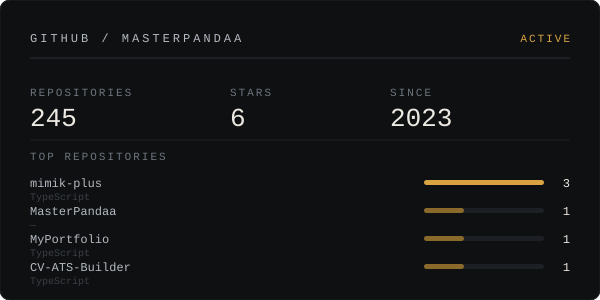
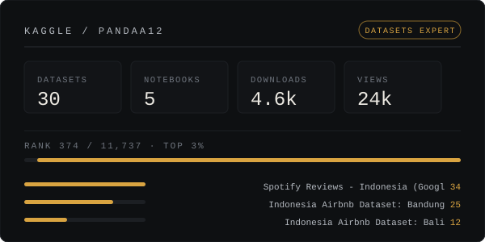

<table width="100%" border="0">
<tr>
<td width="50%" valign="top"></td>
<td width="50%" valign="top"></td>
</tr>
</table>

 

**Selected work**

- [**mimik-plus**](https://github.com/MasterPandaa/mimik-plus) — community fork of Mimik · custom AI providers, Bahasa Indonesia · `TypeScript`
- [**MyPortfolio**](https://github.com/MasterPandaa/MyPortfolio) — portfolio, live at [portofolio-luthfi.up.railway.app](https://portofolio-luthfi.up.railway.app) · `React 19 · TanStack Start · Tailwind v4`
- [**CV-ATS-Builder**](https://github.com/MasterPandaa/CV-ATS-Builder) — ATS-friendly CV builder, v1.0.0 · `TypeScript`
- [**Kaggle**](https://www.kaggle.com/pandaa12) — 30 public datasets, 5 notebooks, Datasets Expert (rank 374 / 11,737) · `Python`

 

Yogyakarta, Indonesia · <a href="mailto:luthfiabd.14@gmail.com">luthfiabd.14@gmail.com</a> · <a href="https://github.com/MasterPandaa">GitHub</a> · <a href="https://www.kaggle.com/pandaa12">Kaggle</a>
