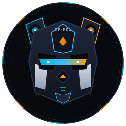

# 🌌 MUHAMMAD LUTHFI ABDILLAH
### `THE POLYMATH ARCHITECT`
**Full-Stack Systems · Big Data & ML Pipelines · Automated QA & SAST Reliability**

 

  

<!-- CENTERPIECE BENTO DASHBOARD -->

 

---

## ⚡ The Polymath Triad Matrix

A unified tri-core engineering system balancing interface craftsmanship, scalable data backends, and rigorous automated reliability.

<table width="100%" border="0">
<tr>
<td width="33%" valign="top">

### ⚡ Pillar 01: Full-Stack Systems
*Engineered for velocity, reactive UX, and high-cadence interfaces.*

- **Core Arsenal:** `React 19` · `TypeScript` · `TanStack Start / Query` · `Tailwind CSS v4` · `Next.js`
- **Architectures:** SSR / Static Hybrid, Real-time state management, modular component design systems.
- **Craft:** ATS formatting engines, cross-platform emulators, and custom AI chat interfaces.

</td>
<td width="33%" valign="top">

### 📊 Pillar 02: Big Data & ML
*Engineered for distributed processing, predictive intelligence, and analytical scale.*

- **Core Arsenal:** `Apache Spark` · `Python` · `FastAPI` · `PostgreSQL` · `Pandas`
- **Verified Standing:** **Kaggle Datasets Expert** (Rank #374 of 11,737 · Top 3.1% Globally).
- **Domain Focus:** NLP sentiment analysis pipelines, TF-IDF regression models, Graph Neural Networks (GNN).

</td>
<td width="33%" valign="top">

### 🛡️ Pillar 03: Automated QA & SAST
*Engineered for zero-regression pipelines, automated hardware interception, and code safety.*

- **Core Arsenal:** `Playwright` · `Selenium` · `Postman` · `Virtual Media Streams (MV3)`
- **Published Research:** SAST Implementation for Evaluating LLM Code Quality (*Jurnal SISTEMASI Sinta 3 · DOI: 10.32520/stmsi.v15i5.6395*).
- **Tooling:** Virtual hardware stream interception for camera-free automated QR/barcode testing.

</td>
</tr>
</table>

---

## 🛸 Selected Mission Works

<table width="100%" border="0">
<tr>
<td width="50%" valign="top">

### 🤖 [Mimik-Plus](https://github.com/MasterPandaa/Mimik-Plus)
> Community fork of Mimik empowering multilingual support and custom LLM provider orchestration.
- **Stack:** `TypeScript · AI Integration · Modern Tooling`
- **Key Capability:** Multi-provider fallback pipelines & native Bahasa Indonesia localization.

</td>
<td width="50%" valign="top">

### 📹 [QR-Camera](https://github.com/MasterPandaa/QR-Camera)
> Manifest V3 browser extension virtualizing webcam video streams with dynamic QR codes for headlessly automated QA suites.
- **Stack:** `JavaScript · Manifest V3 · Automated QA Testing`
- **Key Capability:** Eliminates physical camera dependencies across Opera, Chrome, Edge & Firefox test runners.

</td>
</tr>
<tr>
<td width="50%" valign="top">

### 📈 [Sentilytics-AI](https://github.com/MasterPandaa/Sentilytics-AI)
> Real-time text sentiment intelligence platform with interactive natural language processing dashboards.
- **Stack:** `Python · Django · NLP · Data Analytics`
- **Key Capability:** Live stream text categorization and multi-dimensional statistical charts.

</td>
<td width="50%" valign="top">

### 📜 [Prompt-Engineering-Collection](https://github.com/MasterPandaa/Prompt-Engineering-Collection)
> Academic research repository evaluating LLM-generated software vulnerabilities via Static Application Security Testing (SAST).
- **Stack:** `Python · SAST · LLM Quality Assurance`
- **Publication:** Jurnal SISTEMASI Vol. 15 No. 5 (2026) · Sinta 3 accredited.

</td>
</tr>
<tr>
<td width="50%" valign="top">

### 💼 [PandaaATS-Builder](https://github.com/MasterPandaa/PandaaATS-Builder)
> High-performance, parser-compliant Curriculum Vitae builder generating ATS-validated documents.
- **Stack:** `TypeScript · React · Clean Architecture`
- **Key Capability:** Strict typography formatting ensuring maximum ATS screening scores.

</td>
<td width="50%" valign="top">

### 🌐 [MyPortfolio](https://github.com/MasterPandaa/MyPortfolio)
> Production interactive portfolio showcasing data pipelines, deep-dive experiments, and engineering logs.
- **Stack:** `React 19 · TanStack Start · Tailwind CSS v4`
- **Deployment:** Live at [portofolio-luthfi.up.railway.app](https://portofolio-luthfi.up.railway.app).

</td>
</tr>
</table>

---

## 🐍 Continuous Cadence & Telemetry

### 🟢 Contribution Rhythm
<picture>
  <source media="(prefers-color-scheme: dark)" srcset="assets/snake-dark.svg" />
  <source media="(prefers-color-scheme: light)" srcset="assets/snake.svg" />
  
</picture>

 

---

📍 **YOGYAKARTA, ID** // `7.7956° S, 110.3695° E` · Engineered with precision · Telemetry auto-refreshed via GitHub Actions CI/CD

