<picture>
  <source media="(prefers-color-scheme: dark)" srcset="assets/banner-dark.svg">
  <source media="(prefers-color-scheme: light)" srcset="assets/banner-light.svg">
  
</picture>

English | [Bahasa Indonesia](README.id.md)

### About

Hi, I'm Luthfi (Muhammad Luthfi Abdillah), an IT graduate from Sleman, Yogyakarta, with a 3.83 GPA. I build AI agents and web products end to end, test them with industry-standard QA methods, and engineer the data and machine learning models behind them. My work spans LLM-powered workflow automation with n8n, hospital and education systems in Laravel and Flutter, and machine learning published on Kaggle.

<picture>
  <source media="(prefers-color-scheme: dark)" srcset="assets/stats-en-dark.svg">
  <source media="(prefers-color-scheme: light)" srcset="assets/stats-en-light.svg">
  
</picture>

### Focus

| Area | What I do | Tools |
| :--- | :--- | :--- |
| **AI Agents & LLM** | n8n workflow automation, multi-step webhook and REST orchestration, health assistant chatbots, guardrailed prompting | `n8n` `Gemini` `OpenAI` `Llama` |
| **QA & Testing** | Black-box, regression and SAST testing, XP testing cycles, browser automation | `Playwright` `SAST` |
| **Full-Stack & Mobile** | Web platforms, admin systems and cross-platform apps | `Laravel` `React 19` `Next.js` `TypeScript` `Flutter` `Django` |
| **Data & ML** | ETL pipelines, scraping, NLP, classical ML and graph neural networks | `Python` `scikit-learn` `PyTorch Geometric` `Spark` `Kafka` |
| **Infra & Design** | Databases, containers and UI/UX prototyping | `PostgreSQL` `MySQL` `MongoDB` `Docker` `Kubernetes` `Figma` |

### Experience

| Period | Role | Highlights |
| :--- | :--- | :--- |
| Mar 2025 to Jan 2026 | **Full-Stack Developer Intern**, PT Global Data Inspirasi (Datains) | Built ASSRI, a medical teleconsultation simulator in Laravel, with an n8n AI agent (Gemini, OpenAI, Llama) for pre-consultation screening and scheduling. |
| Jul to Aug 2025 | **Freelance Full-Stack Developer**, SDIT Luqman Al Hakim | School website with a self-managed CMS of 15+ admin modules, tested in XP cycles. |
| May to Jun 2025 | **Freelance Full-Stack Developer**, Life Media | Multi-tenant SPMB admissions SaaS in Laravel with PDF and Excel reports. |
| Oct 2024 to Jan 2025 | **Full-Stack Developer Intern**, AMC Muhammadiyah Hospital | Three hospital web systems (check-up records, leave approval with a 100% black-box pass rate, face and GPS attendance) and the SatuAMC Flutter app. |

### Featured projects

| Project | What it does |
| :--- | :--- |
| **ASSRI** | Medical teleconsultation simulator with an n8n AI agent for patient screening |
| **Healtisin** | Health screening chatbot, semi-finalist at PROXOCORIS International |
| **SatuAMC** | Cross-platform Flutter hospital app for attendance and leave |
| **SPMB SaaS** | Multi-tenant student admissions portal with PDF and Excel reports |
| **QR-Camera** | Browser extension that injects a virtual QR video stream for webcam QA tests |
| **Prompt-Engineering-Collection** | SAST research repo for evaluating LLM-generated code quality |
| **Flowerhub Marketplace** | Flower-order e-commerce with Midtrans payments |
| **Tokprice-Predictor** | E-commerce price prediction app using TF-IDF and regression |
| **Yahoo Finance Dashboard** | Real-time stock dashboard with interactive candlesticks |
| **HOPE (Hospital Maze)** | C++ console maze game solved with DFS |

More at [github.com/MasterPandaa](https://github.com/MasterPandaa?tab=repositories).

### Data science and Kaggle

| Model | Approach | Result |
| :--- | :--- | :--- |
| Fraud detection | Logistic Regression | 94% accuracy, 0.89 precision, 0.82 recall |
| Gojek review sentiment | TF-IDF + Random Forest | 86% accuracy, F1 0.84 |
| Spotify review sentiment | Bi-LSTM + word embeddings | 89% accuracy, F1 0.87 |
| Film recommender | GraphSAGE (PyTorch Geometric) | Recall@10 0.31, NDCG@10 0.28 |
| Tokopedia sales prediction | Ridge Regression | R² 0.78, RMSE 42.3 |
| Preeclampsia risk | Random Forest multiclass | 91% accuracy, 0.88 recall |

I also publish open datasets on [Kaggle](https://www.kaggle.com/pandaa12): about 50,000 Tokopedia products, 18,000 YouTube comments on the 2025 Sumatra floods, 12 Google Play review sets, Yogyakarta hotels from Traveloka, and TMDB movies. Each comes with its own scraper (Playwright, `google-play-scraper`, TMDB API).

### Research and recognition

- **2026**: SAST research on LLM-generated code quality via prompt engineering.
- **2025**: semi-finalist at PROXOCORIS International Competition with Healtisin.
- **2025**: community service in digital literacy (PKM Pra Ngadisuryan, KKN Dabag 2).
- **2024**: journal paper on a web-based leave information system for Asri Medical Center Hospital.
- **2024**: University Outstanding Student (Mawapres), BNSP certification and an HKI intellectual property registration from Kemenkumham RI.

 

<a href="mailto:luthfiabd.14@gmail.com">
<picture>
  <source media="(prefers-color-scheme: dark)" srcset="assets/cta-en-dark.svg">
  <source media="(prefers-color-scheme: light)" srcset="assets/cta-en-light.svg">
  
</picture>
</a>

[Portfolio](https://portofolio-luthfi.up.railway.app) | [LinkedIn](https://www.linkedin.com/in/luthfiabdl/) | [Kaggle](https://www.kaggle.com/pandaa12) | [Email](mailto:luthfiabd.14@gmail.com) | [WhatsApp](https://wa.me/62895640311157) | [Instagram](https://instagram.com/luthfiabdl_)